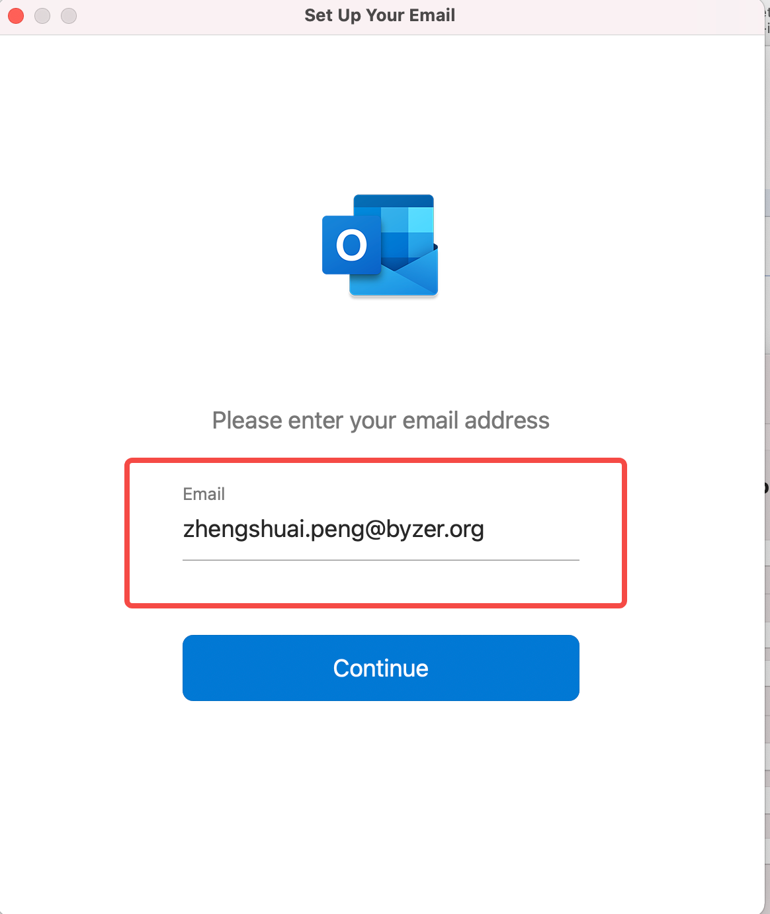
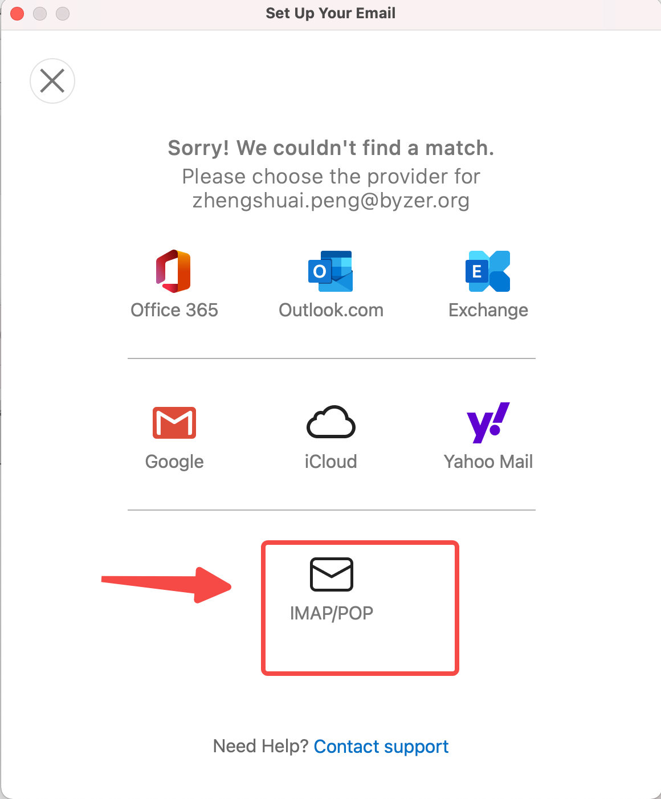
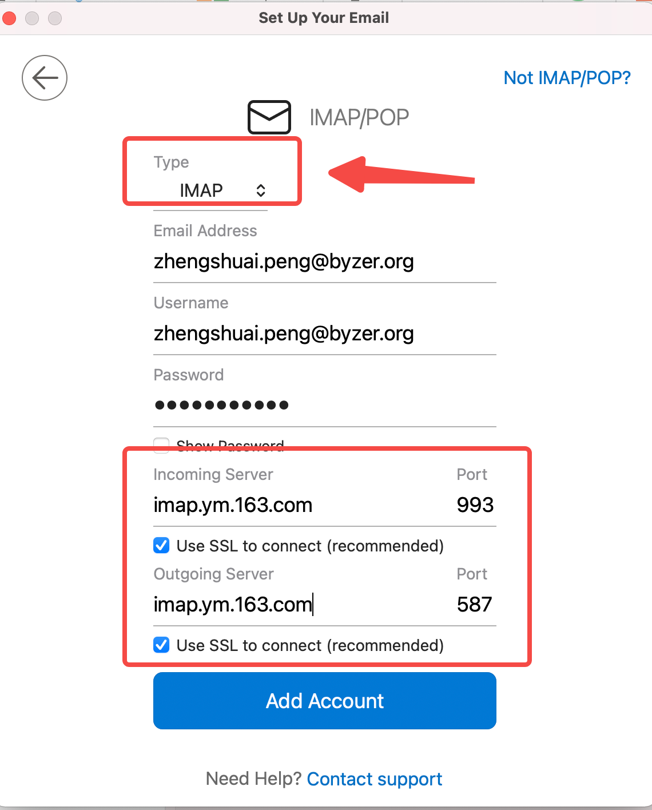

## 如何获得 Byzer 社区邮箱 / Get the email account of Byzer community

当您成为社区 Committer 或对应级别的其他角色后，您将会获得 Byzer 社区的邮箱 (account@byzer.org) 

When you become a Community Committer or other role of the corresponding level, you will get the Byzer Community Email (account@byzer.org)

## 邮箱初始化 / Initialization

当收到您的邮箱账号后，您可以登录 [http://ym.163.com](http://ym.163.com) 进行邮箱初始化和修改密码，随后您就可以使用该邮箱进行收发信件。

After receiving your email account, you can log in to [http://ym.163.com](http://ym.163.com) to initialize your email and change your password, and then you can use this email to send and receive letter.

## 设置邮件客户端 / Setup Email Client

 Byzer Org 邮箱支持 POP3/IMAP/SMTP 服务，您可以通过电脑客户端软件更好地收发邮件，服务器地址：

- **POP3**：`pop.ym.163.com` 默认端口为：`110` （如勾选ssl安全链接，端口号为`995`）
- **SMTP**：`smtp.ym.163.com` 默认端口为：`25` （如勾选ssl安全链接，端口号为`994`）
- **IMAP**：`imap.ym.163.com` 默认端口为：`143` （如勾选ssl安全链接，端口号为`993`）

Byzer Org email supports POP3/IMAP/SMTP services, you can better send and receive emails through computer client software, the server address:

- **POP3**: `pop.ym.163.com` The default port is: `110` (if ssl secure link is checked, the port number is `995`)
- **SMTP**: `smtp.ym.163.com` The default port is: `25` (if ssl secure link is checked, the port number is `994`)
- **IMAP**: `imap.ym.163.com` The default port is: `143` (if ssl secure link is checked, the port number is `993`)

## 在 Microsoft Outlook 使用 Byzer Org 邮箱 / Use Byzer Org email in Microsoft Outlook

1. 在 Outlook 中添加新的邮箱账号 / Add new account in Outlook

2. 选择 IMAP/POP 协议 / Choose IMAP/POP protocol

3. 输入账号密码，收发服务器以及对应端口 / Input account & password, incoming & outgoing server and ports

4. 账号添加完毕 / Your account has been setup 